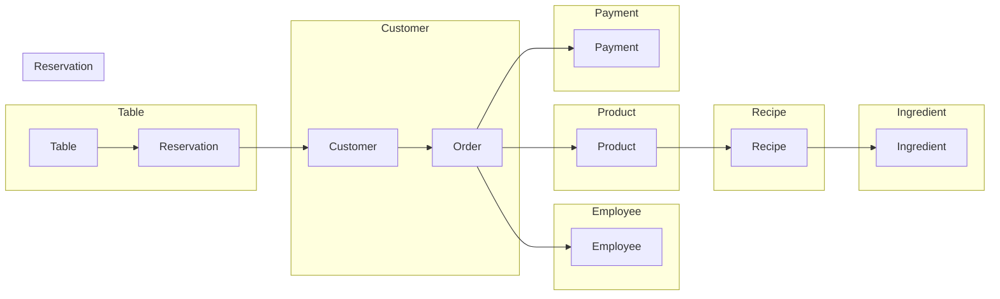

# CAFE Management

- [CAFE Management](#cafe-management)
  - [Project information](#project-information)
  - [Functions](#functions)
  - [Entity Relations Diagram (ERD)](#entity-relations-diagram-erd)
- [List To Do](#list-to-do)
- [Note](#note)
  - [CSRF TOKEN](#csrf-token)

## Project information

- Back-End
  - Django Framework
- API
  - Django REST framework
  - Axios
- Database
  - posgresQL
- Front-End
  - VueJs
  - Bootstrap 5

[▲ back](#cafe-management)

## Functions

1. ระบบสมาชิก ลูกค้า
   1. การสะสมแต้ม
   2. ตะกร้าสินค้า
   3. สร้างคำสั่งซื้อ
   4. จองโต๊ะในร้าน
2. ระบบพนักงาน
   1. พนักงานรับออร์เดอร์
3. ระบบคำสั่งซื้อ
   1. เลือกสินค้า
   2. สร้างคำสั่งซื้อโดยลูกค้า
   3. เลือกช่องทางการชำระเงิน
   4. รับคำสั่งซื้อโดยพนักงาน
   5. สถานะคำสั่งซื้อ
4. ระบบสินค้า
   1. สูตรสินค้า
   2. ส่วนผสมสินค้า

## Entity Relations Diagram (ERD)



---

This ERD model shows the entities and relationships in a coffee shop full system. The entities are Customer, Employee, Product, Order, Payment, Ingredient, Recipe, and Table. The relationships between the entities are:

- Customer is related to Order.
- Employee is related to Order.
- Product is related to Recipe.
- Recipe is related to Ingredient.
- Order is related to Payment.
- Table is related to Reservation.

This ERD model is a high-level representation of the data in a coffee shop full system. It can be used to design the database for the system and to develop the software for the system.

[▲ back](#cafe-management)

# List To Do

* [ ] สร้าง API
  * [X] API การลงทะเบียนลูกค้า
  * [X] API การลงทะเบียนพนักงาน
  * [ ] API แสดงสินค้าทั้งหมด
  * [X] API แสดงคำสั่งซื้อ
  * [ ] API เพิ่มสินค้าในตะกร้า
  * [ ] API แสดงสินค้าในตะกร้า
  * [ ] API ลบสินค้าในตะกร้า
  * [X] API สร้างคำสั่งซื้อ
  * [X] API การยืนยันคำสั่งซื้อ
  * [ ] API การจองโต๊ะ
* [ ] ติดตั้ง Templates
  * [ ] หน้าแสดงรายการสินค้า
  * [ ] หน้าตะกร้าสินค้า
  * [ ] หน้าคำสั่งซื้อ
  * [ ] หน้าแสดงคำสั่งซื้อ
  * [ ] หน้าแสดงโต๊ะสำหรับจอง

# Note

## CSRF TOKEN

```javascript
form_data.append("csrfmiddlewaretoken", "{{csrf_token}}");
```

[▲ back](#cafe-management)
