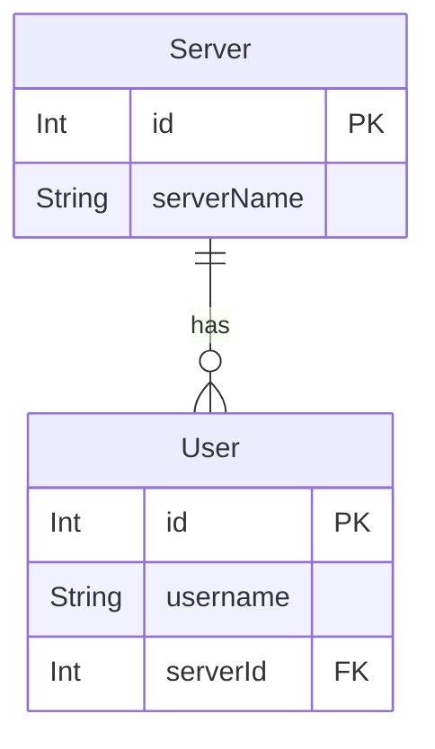

# CAFE Management

- [CAFE Management](#cafe-management)
  - [Project information](#project-information)
  - [Entity Relations Diagram (ERD) designed with BARD](#entity-relations-diagram-erd-designed-with-bard)
  - [Entity Relations Diagram (ERD) to Django models](#entity-relations-diagram-erd-to-django-models)
- [Note](#note)
  - [CSRF TOKEN](#csrf-token)

## Project information

- Back-End
  - Django Framework
- API
  - Django REST framework
  - axios
- Database
  - unknown
- Front-End
  - VueJs
  - Bootstrap 5

[▲ back](#cafe-management)

## Functions

1. Customer Register
   1. Customer Royalty Points
2. Employee Register
   1. Employee Position
3. Order managemant
   1. Create order by Customer
   2. Accept order by Employee
4. Payment
   1. Select payment

## Entity Relations Diagram (ERD) designed with BARD




This ERD model shows the entities and relationships in a coffee shop full system. The entities are Customer, Employee, Product, Order, Payment, Ingredient, Recipe, and Table. The relationships between the entities are:

- Customer is related to Order.
- Employee is related to Order.
- Product is related to Recipe.
- Recipe is related to Ingredient.
- Order is related to Payment.
- Table is related to Reservation.

This ERD model is a high-level representation of the data in a coffee shop full system. It can be used to design the database for the system and to develop the software for the system.

[▲ back](#cafe-management)

## Entity Relations Diagram (ERD) to Django models

```python
from django.db import models
from django.contrib.auth.models import User

# Create your models here.

EMP_POSITION = (
    (1, "Manager"),
    (2, "Assistant Manager"),
    (3, "Cashier"),
    (4, "Barista"),
    (5, "Baker"),
    (6, "Server"),
    (7, "Delivery Driver"),

)

ORDER_STATUS = (
    (1, "waiting"),
    (2, "ordered")
    (3, "success"),
    (4, "cancel"),

)

PAYMENT = (
    (1, "credit card"),
    (2, "cash"),
    (3, "coupon"),
)

class Category(models.Model):
    category = models.CharField(max_length=128)

    def __str__(self):
        return self.category


class Customer(models.Model):
    user = models.ForeignKey(User, on_delete=models.CASCADE)

    # address
    address = models.TextField(default="-", blank=True)
    sub_district = models.CharField(max_length=256, blank=True)
    district = models.CharField(max_length=256, blank=True)
    province = models.CharField(max_length=256, blank=True)

    # contacts
    phone = models.CharField(max_length=10, blank=True)

    # points
    loyalty = models.IntegerField()

    def __str__(self):
        return self.user.username


class Employee(models.Model):
    user = models.ForeignKey(User, on_delete=models.CASCADE)

    address = models.TextField(default="-", blank=True)
    sub_district = models.CharField(max_length=256)
    district = models.CharField(max_length=256)
    province = models.CharField(max_length=256)

    # contacts
    phone = models.CharField(max_length=10)

    # points
    position = models.IntegerField(choices=EMP_POSITION)

    def __str__(self):
        return self.user.username+" : "+self.position


class Product(models.Model):
    name = models.CharField(max_length=256)
    desc = models.TextField()
    price = models.DecimalField(max_digits=3, decimal_places=2)

    category = models.ForeignKey(Category, on_delete=models.CASCADE)
    stock_level = models.IntegerField()

    def __str__(self):
        return self.name


class Order(models.Model):
    customer = models.ForeignKey(Customer, on_delete=models.CASCADE)
    employee = models.ForeignKey(Employee, on_delete=models.CASCADE)
    product = models.ForeignKey(Product, on_delete=models.CASCADE)
    quantity = models.IntegerField()
    price = models.DecimalField(max_digits=3, decimal_places=2)

    order_status = models.IntegerField(choices=ORDER_STATUS)
    order_date = models.DateTimeField(auto_now_add=True)
    order_finish = models.DateTimeField(auto_now_add=True)

    def __str__(self):

        return self.product+" : "+self.order_status


class Payment(models.Model):
    order = models.ForeignKey(Order, on_delete=models.CASCADE)

    payment_method = models.IntegerField(choices=PAYMENT)
    amount = models.DecimalField(max_digits=3, decimal_places=2)

    def __str__(self):
        return f"{self.order} {self.amount}"


class Ingredient(models.Model):

    name = models.CharField(max_length=256)
    desc = models.TextField()
    cost = models.DecimalField(max_digits=3, decimal_places=2)

    def __str__(self):
        return self.name


class Recipe(models.Model):
    product = models.ForeignKey(Product, on_delete=models.CASCADE)
    ingredient = models.ForeignKey(Ingredient, on_delete=models.CASCADE)
    quantity = models.IntegerField()

    def __str__(self):
        return self.product


class Table(models.Model):
    name = models.CharField(max_length=128)
    capacity = models.IntegerField()

    def __str__(self):
        return self.name


class Reservation(models.Model):
    table = models.ForeignKey(Table, on_delete=models.CASCADE)
    customer = models.ForeignKey(Customer, on_delete=models.CASCADE)

    start_time = models.DateTimeField(auto_now_add=True)
    end_time = models.DateTimeField(auto_now_add=True)

    def __str__(self):
        return self.table

```

[▲ back](#cafe-management)

# Note

## CSRF TOKEN

```javascript
form_data.append("csrfmiddlewaretoken", "{{csrf_token}}");
```

[▲ back](#cafe-management)
