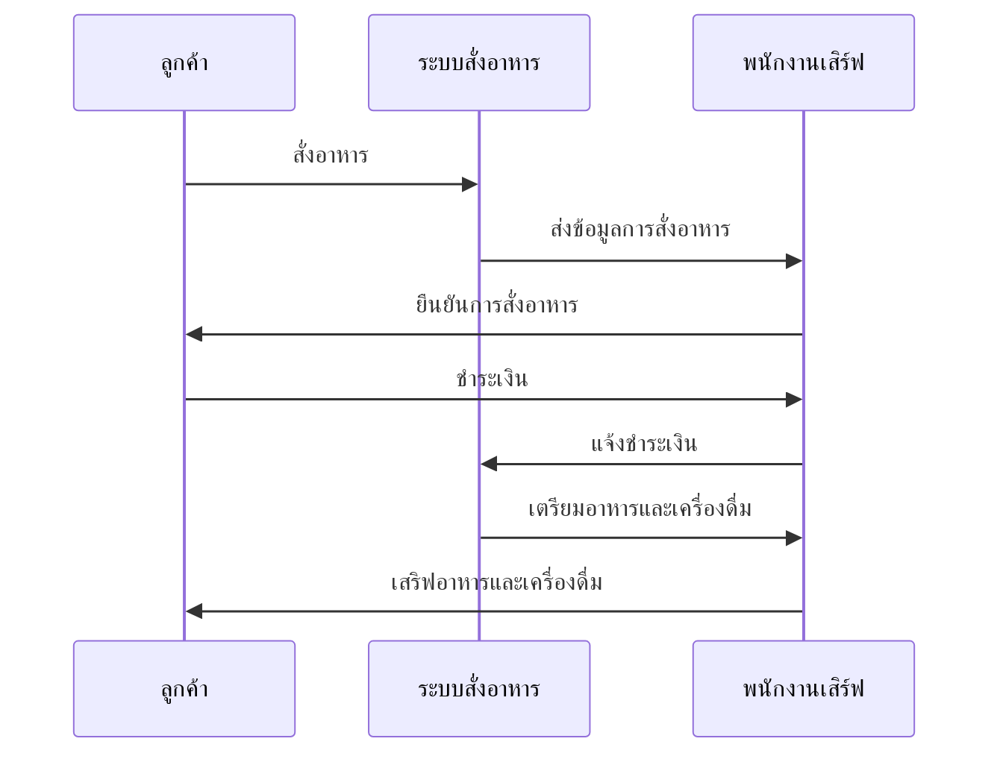
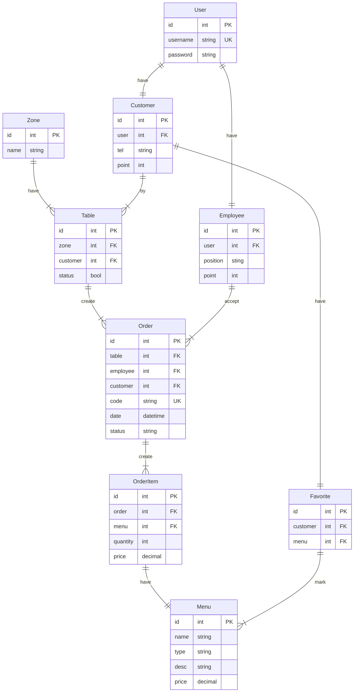

# CAFE Management

## Diagram

```mermaid

sequenceDiagram
  participant C as ลูกค้า
  participant S as ระบบสั่งอาหาร
  participant P as พนักงานเสิร์ฟ

  C ->> S: สั่งอาหาร
  S ->> P: ส่งข้อมูลการสั่งอาหาร
  P ->> C: ยืนยันการสั่งอาหาร
  C ->> P: ชำระเงิน
  P ->> S: แจ้งชำระเงิน
  S ->> P: เตรียมอาหารและเครื่องดื่ม
  P ->> C: เสริฟอาหารและเครื่องดื่ม

```

## ERD

```mermaid

erDiagram

  User {
    id int PK
    username string UK
    password string
  }

  Customer {
    id int PK 
    user int FK 
    tel string
    point int 
  }

  Employee {
    id int PK 
    user int FK
    position sting 
    point int
  }

  Favorite {
    id int PK 
    customer int FK
    menu int FK
  }

  Menu {
    id int PK
    name string
    type string
    desc string
    price decimal
  }

  Zone {
    id int PK 
    name string
  }

  Table {
    id int PK
    zone int FK
    customer int FK
    status bool 
  }

  Order {
    id int PK 
    table int FK 
    employee int FK
    customer int FK
    code string UK
    date datetime 
    status string 

  }

  OrderItem {
    id int PK 
    order int FK 
    menu int FK 
    quantity int
    price decimal
  }


  User ||--|| Customer : have
  User ||--|| Employee : have
  Zone ||--|{ Table : have
  Table ||--|{ Order : create
  Order ||--|{ OrderItem : create
  OrderItem ||--|| Menu : have
  Customer ||--|{ Table : by
  Customer ||--|| Favorite : have
  Favorite ||--|{ Menu : mark
  Employee ||--|{ Order : accept

```
